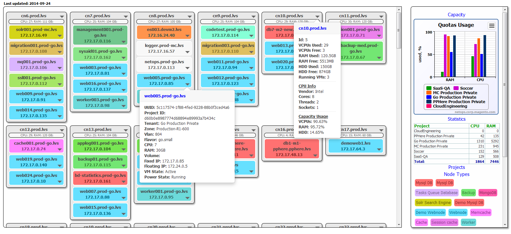

# LVS-VMS #

OpenStack virtual hosts distribution across hypervisors

`openstack` `visualized` `data visualization` `nova` `infrastructure`

---

## Change history ##

Magic jump to [README] file

### [v0.0.1](https://github.com/tbaltrushaitis/lvs-vms/releases/tag/v0.0.1) ###
 - [x] + [License]
 - [x] + Makefile
 - [x] + [README]

### [v0.0.0](#) (2014) ###
- [x] Repository Init
- [x] Initial commit

---

> Developed in **2014**

:scorpius:

[README]: README.md
[License]: LICENSE.md
