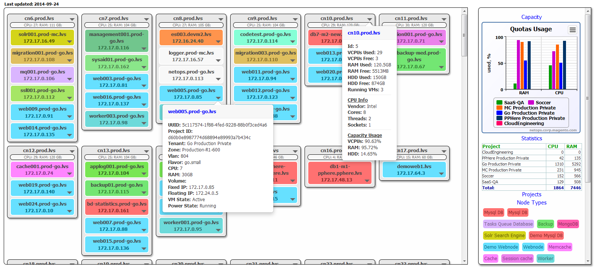

# LVS-VMS #

OpenStack virtual hosts distribution across hypervisors

[](https://github.com/conventional-changelog/standard-version)



`cmdb` `real-time` `tasks` `queue` `progress` `monitoring` `visualized` `data visualization`

---

## Live Demo ##
We provide this [page](http://bit.ly/lvs-vis) :point_left: for testing purposes

---

## Getting started ##

Its simple. Get it done in the way like this piece of shi*, sorry, of course pieces of code below:

Simply clone the repository and then run `make` inside of a cloned directory:

```shell
$  REPO="lvs-vms" \
&& git clone "https://github.com/tbaltrushaitis/${REPO}" \
&& cd ${REPO} ;
```

---

## Credits ##

 Scope | Role | Name | Version | Description
:-----:|:----:|:-----|:-------:|:------------
 Front | Framework | [Bootstrap](http://getbootstrap.com) | [3.0.3](https://getbootstrap.com/docs/3.4/) | HTML, CSS, and JS framework
 Front | Library | [jQuery](http://jquery.com/) | [1.10.2](https://github.com/jquery/jquery/tree/1.10.2) | JavaScript Library
 Front | Library | [Underscore](https://underscorejs.org/) | 1.5.2 | A modern JavaScript utility library delivering modularity, performance & extras.

---

See the [Changelog][Changelog] for the history of project changes and improvements.

---

This product is [MIT Licensed][License]

---

### More Info ###

 - [GitHub / Basic writing and formatting syntax](https://help.github.com/articles/basic-writing-and-formatting-syntax/)
 - [BitBucket Markdown Howto](https://bitbucket.org/tutorials/markdowndemo)
 - [Creating an Automated Build](https://docs.docker.com/docker-hub/builds/)
 - [Linking containers](https://docs.docker.com/engine/userguide/networking/default_network/dockerlinks.md)
 - [Cross-host linking containers](https://docs.docker.com/engine/admin/ambassador_pattern_linking.md)
 - [Linking containers](https://docs.docker.com/engine/userguide/networking/default_network/dockerlinks.md)

---

> Developed in **2014**

:scorpius:

[Changelog]: CHANGELOG.md
[License]: LICENSE.md
